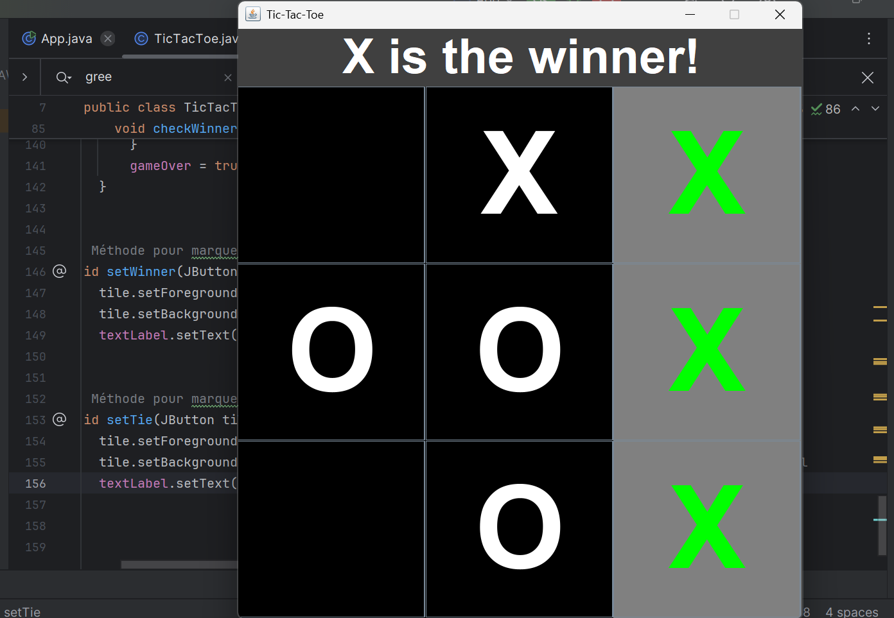
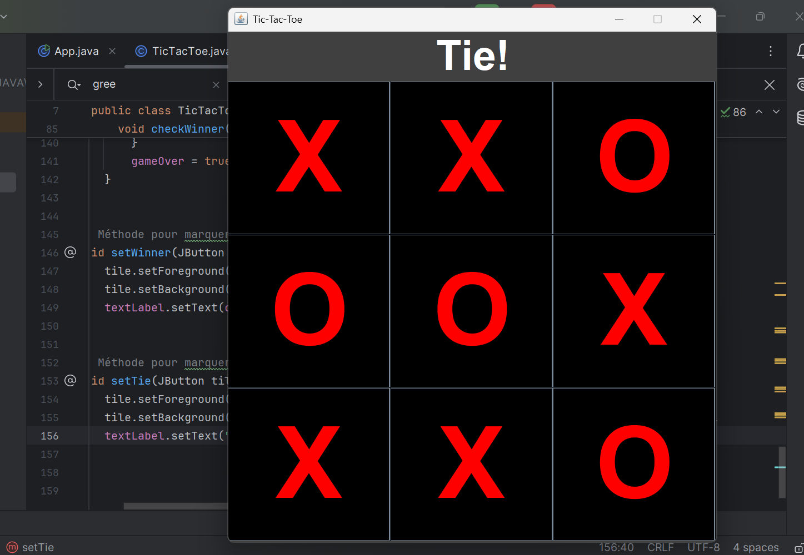

# TicTacToe-XO

## Description
Ce projet est une implémentation du jeu Tic-Tac-Toe (XO) en Java en utilisant Swing pour l'interface graphique. Le jeu permet à deux joueurs de jouer en alternance sur un plateau de 3x3.

## Fonctionnalités
- Interface graphique avec Swing
- Suivi du tour des joueurs
- Détection des conditions de victoire et de match nul
- Affichage du gagnant ou d'un match nul

## Captures d'écran



## Prérequis
- Java Development Kit (JDK) 8 ou supérieur

## Installation
1. Clonez le repository :
   ```bash
   git clone https://github.com/yasshb/TicTacToe-XO-.git
